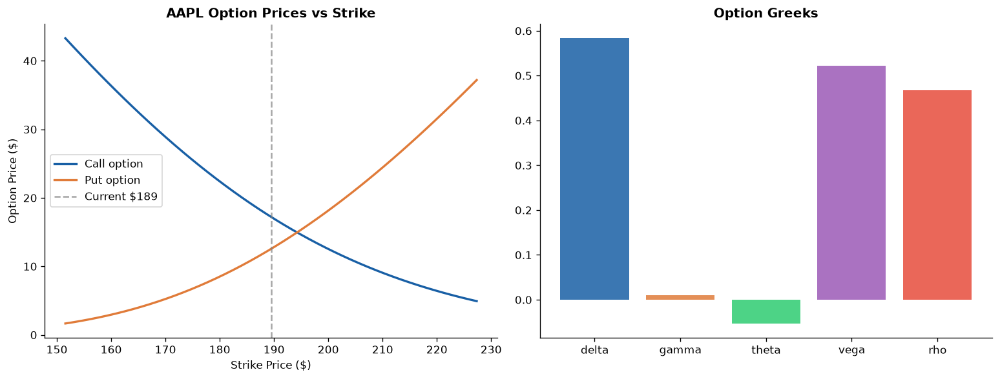
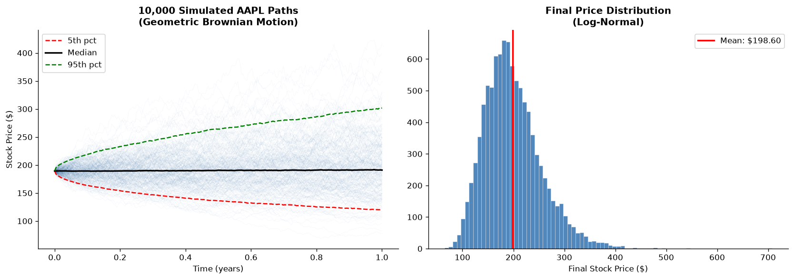
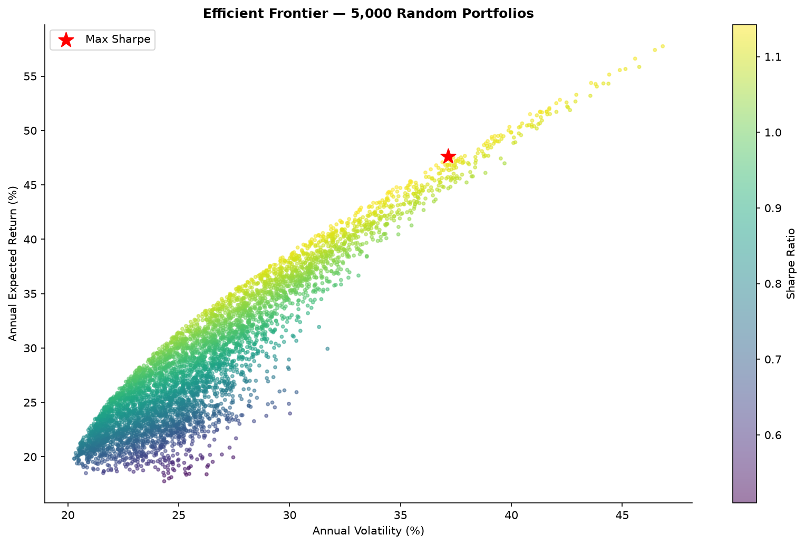
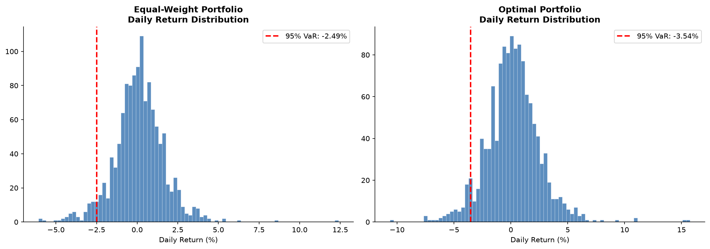

# Quantitative Finance from First Principles

> Black-Scholes option pricing, Monte Carlo simulation, portfolio VaR
> and the Efficient Frontier — built by a Physics student deliberately.

Every model here connects to the Physics curriculum:

| Finance model | Physics equivalent |
|---|---|
| Black-Scholes PDE | Heat diffusion equation |
| Geometric Brownian Motion | Wiener process / Brownian motion |
| Monte Carlo option pricing | Statistical mechanics ensemble averaging |
| Efficient Frontier | Constrained optimisation (Lagrange multipliers) |
| Value at Risk | Tail statistics / confidence intervals |

---

## Notebook

Main deliverable — renders directly in GitHub:
**[notebooks/quant_finance.ipynb](notebooks/quant_finance.ipynb)**

---

## Charts

---

## Skills demonstrated

| Skill | How |
|---|---|
| Mathematical modelling | PDE derivation, stochastic calculus, matrix algebra |
| Python — scientific computing | NumPy vectorisation, SciPy optimisation |
| Statistical analysis | VaR, CVaR, distributions, confidence intervals |
| Financial APIs | yfinance for real 5-year price data |
| Jupyter notebooks | Research-paper style with explanations |

---

## Quick start

git clone https://github.com/ollie48654/quantitative-finance-physics
cd quantitative-finance-physics
python -m venv venv && venv\Scripts\activate
pip install -r requirements.txt
python scripts/fetch_data.py
python scripts/black_scholes.py
python scripts/monte_carlo.py
python scripts/portfolio_risk.py
jupyter notebook notebooks/quant_finance.ipynb

---

## Why Physics?

The mathematical tools in quantitative finance — stochastic differential
equations, PDEs, Monte Carlo methods, optimisation — are the same tools
used in theoretical and computational physics. This project is a
deliberate demonstration of that overlap.